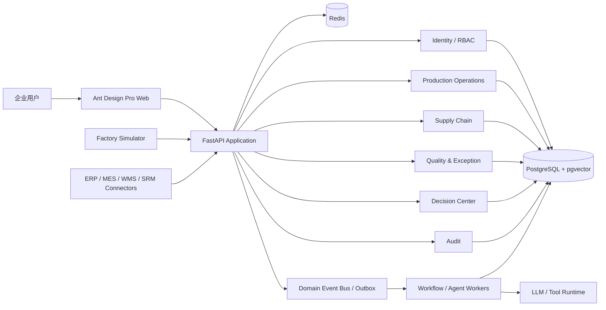

# Phase 0.8 — System Architecture Baseline

## Purpose

本文固化 FactoryPilot 在进入业务开发前的系统架构边界。当前项目面向离散制造企业，目标是形成“生产运营 + 供应链协同 + AI 决策”的完整企业应用，而不是单纯的聊天式 Agent Demo。

Phase 0.8 只定义架构契约，不在本阶段提前实现业务表、业务 API、工作流或 Agent Runtime。

## Architecture Principles

1. **业务系统优先，Agent 增强而不是取代业务系统。** 订单、物料、生产、采购、质量、异常、审批等状态由确定性业务服务维护。
2. **领域模型优先于页面模型。** 前端页面可以变化，领域实体、聚合边界和业务约束必须稳定。
3. **决策可解释。** 所有 AI 建议必须能够追溯到输入数据、规则、模型调用、工具调用和审批结果。
4. **写操作受控。** Agent 默认产生建议；涉及订单、采购、排产、库存、质量状态的高影响写操作必须通过权限与审批边界。
5. **事件驱动解耦。** 跨领域状态传播使用领域事件，避免直接跨模块修改内部数据。
6. **单体优先，边界清晰。** 早期采用模块化单体 + Worker，待吞吐量、团队边界或可靠性需求明确后再拆服务。

## Logical Architecture



> 当前已经实现 Web、FastAPI、PostgreSQL、Redis 与 Docker Compose 基础设施；Identity、业务领域模块、Outbox、Workflow、Agent Runtime、Simulator 与外部系统集成属于后续 Phase。

## Deployment Baseline

### Development

```text
Browser
  │
  ▼
frontend :8001
  │ /api proxy
  ▼
backend :8000
  ├── postgres :5432 (host 55432)
  └── redis    :6379 (host 56379)
```

所有服务位于 `factorypilot-network`。容器内部使用服务 DNS 名通信；宿主机端口只用于开发调试。

### Future Production Shape

生产部署预留以下逻辑组件，但当前不绑定特定云厂商：

- Web static assets / reverse proxy
- FastAPI replicas
- PostgreSQL HA / backup
- Redis HA
- Workflow workers
- Agent workers
- Object storage
- Observability stack
- Secrets management
- External integration gateway

## Bounded Contexts

### Identity & Organization

职责：用户、组织、岗位、角色、权限、数据范围、登录会话、审计主体。

### Master Data

职责：工厂、车间、产线、设备、客户、供应商、物料、产品、BOM、Routing 等稳定主数据。

### Order Fulfillment

职责：销售订单、订单行、交付承诺、ETA、风险状态、履约进度。

### Production Operations

职责：生产计划、工单、工序、产线负载、计划达成、设备与在制状态。

### Material & Inventory

职责：库存 Lot、可用量、安全库存、齐套结果、短缺风险。

### Procurement & Supplier

职责：采购订单、采购行、供应商交付、ETA、OTD、供应风险。

### Quality & Exception

职责：质量检验、Quality Hold、异常、影响范围、处置闭环。

### Decision & Approval

职责：决策建议、证据、风险等级、审批、执行状态、决策回放。

### Agent Runtime

职责：LLM、工具、RAG、MCP、Agent Trace、受控动作执行。Agent Runtime 不直接拥有核心制造业务事实。

## Data Ownership Rules

- 一个领域只能通过自身 Repository 修改其聚合状态。
- 其他领域读取数据时优先通过公开 Query/API；高频投影可以由事件构建 read model。
- PostgreSQL 是核心事务事实源。
- Redis 仅用于缓存、短期状态、限流、分布式协调等可重建数据，不作为核心业务事实源。
- 向量数据存储在 pgvector，但知识向量不得替代结构化业务数据。
- AI 输出必须区分 `fact`、`inference`、`recommendation` 与 `action`。

## Write Safety Boundary

Agent 或自动化流程发起写操作时分为三类：

| 等级 | 示例 | 默认策略 |
| --- | --- | --- |
| L0 | 查询、总结、风险解释 | 可自动执行 |
| L1 | 创建草稿、生成建议、建立待办 | 可自动执行并记录审计 |
| L2 | 修改采购优先级、调整生产建议、触发业务通知 | 需策略校验，可配置审批 |
| L3 | 修改正式订单、释放 Quality Hold、确认采购/排产 | 强制权限 + 审批 + 幂等 + 审计 |

## Cross-cutting Concerns

所有业务模块统一遵守：

- `/api/v1` 版本化
- `X-Request-ID` / correlation id
- 结构化日志
- RBAC + data scope
- 审计事件
- 幂等键
- UTC 持久化时间，API 使用 ISO 8601
- 乐观并发控制预留 `version`
- 不在异常文本中泄露内部凭证、连接串或模型密钥

## Phase 0 Exit Architecture

Phase 0 完成后，FactoryPilot 应具备：

- 可运行的前后端工程骨架
- 企业级 UI 信息架构
- PostgreSQL / Redis 数据底座
- Docker Compose 一键开发环境
- CI 质量门禁
- 领域边界与 ERD 基线
- API / Event 契约

从 Phase 1 开始，新增业务代码应遵守本架构基线；如果需要突破边界，应先新增 ADR。