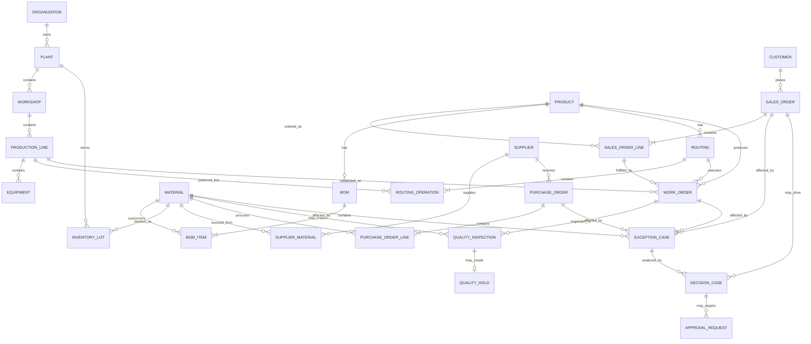

# FactoryPilot Core Domain ERD

## Scope

本文定义 Phase 0.8 的概念 ERD，用于后续 Alembic 迁移与领域模型实现。它描述业务事实之间的稳定关系，但**不是当前数据库已经存在的表结构**。

设计目标是保证后续虚构数据也遵循真实制造业务关系：订单、SKU、BOM、物料、供应商、Routing、设备、库存 Lot、采购 ETA、质量状态之间必须可追溯。

## Core ERD



## Entity Baseline

### Organization / Plant / Workshop / ProductionLine / Equipment

制造组织结构。后续所有订单、库存、工单、设备和权限数据范围都应能够映射到组织或工厂维度。

关键字段建议：

- stable business code
- display name
- status
- timezone / location where relevant
- parent relationship
- `created_at`, `updated_at`, `version`

### Customer

客户主数据。只保存订单履约需要的企业信息和业务分类，不把 CRM 作为本项目 Phase 1 的范围。

### Product

可销售或可制造的成品/半成品。产品必须能关联有效 BOM 与 Routing 版本。

### Material

生产所需的原材料、电子元件、包装物等。物料编码必须稳定，单位、关键料属性、安全库存等属于主数据。

### BOM / BOMItem

BOM 必须版本化，并具备生效区间或状态。`BOMItem` 描述父产品生产单位数量所需物料及损耗等信息。

业务约束：

- 同一产品同一时间只能有明确的有效 BOM 版本。
- 已被正式工单引用的 BOM 版本不得被无审计覆盖修改。

### Routing / RoutingOperation

描述产品的生产工艺路径。Operation 可配置标准工时、首选工作中心或产线、关键设备能力等。

### SalesOrder / SalesOrderLine

订单履约聚合。订单行绑定产品、数量、承诺日期与客户要求。

建议核心状态：

```text
DRAFT → CONFIRMED → PLANNED → IN_PRODUCTION → PARTIALLY_SHIPPED → COMPLETED
                         ↘ ON_HOLD / CANCELLED
```

### WorkOrder

生产执行的核心实体。来源于一个或多个订单需求，绑定产品、Routing、计划数量、产线和计划时间窗口。

### InventoryLot

批次库存事实。建议保存：

- material_id
- plant/location
- lot_no
- on_hand_qty
- reserved_qty
- available_qty
- quality_status
- expiry / received time where relevant

`available_qty` 应由确定性规则计算或维护，不允许 Agent 直接凭文本修改。

### SupplierMaterial

供应商与物料之间的多对多关系，承载优选等级、报价、MOQ、标准交期、质量等级、有效期等采购属性。

### PurchaseOrder / PurchaseOrderLine

采购事实。行级维护承诺日期、预测 ETA、收货进度、延期原因与风险等级。

### QualityInspection / QualityHold

质量检验可以针对来料、工单过程或成品。严重问题形成 `QualityHold`，Hold 的释放属于高影响写操作，必须审计并预留审批能力。

### ExceptionCase

统一异常中心实体，用于表达跨领域异常而不是复制业务事实。异常必须保留：

- source domain
- source entity id
- severity
- detected_at
- owner
- status
- root cause / resolution summary

### DecisionCase

AI/规则决策中心的可追溯对象。它保存输入快照引用、证据、候选方案、风险、推荐方案、模型/规则版本和执行状态。

业务原则：`DecisionCase` 只能引用业务事实，不成为订单、库存、采购或质量状态的替代事实源。

### ApprovalRequest

高影响决策的审批记录。后续可支持多级审批，但 Phase 1 先实现组织/RBAC 基础后再落表。

## Identity Strategy

建议同时保留两类标识：

- `id`: 数据库内部 UUID，适合跨服务和事件引用。
- `code` / `order_no` / `material_code`: 企业可读业务编号，需唯一约束。

不使用业务编号作为数据库主键，避免编码规则变化影响引用关系。

## Time and Versioning

- 数据库存储 UTC timestamp。
- API 使用 ISO 8601。
- BOM、Routing、供应关系等配置型主数据必须版本化或保留有效期。
- 核心可变聚合预留 `version` 字段用于 optimistic locking。

## Deletion Policy

核心制造业务数据默认**不物理删除**：

- 主数据使用 active/inactive 或 effective period。
- 订单、工单、采购、质量、异常、决策、审批使用状态流转。
- 只有明确的临时草稿或测试数据才允许受控硬删除。

## Phase Mapping

ERD 将按阶段逐步实现：

- Phase 1: Identity / Organization / RBAC / Audit
- Phase 2+: Master Data
- 后续业务阶段：Order、Production、Material、Procurement、Quality、Exception
- Decision / Agent 阶段：DecisionCase、Approval、Trace、Evidence

每次正式新增领域表时，应从本文提取最小必要模型，再通过 Alembic 落地，而不是一次性创建所有概念实体。